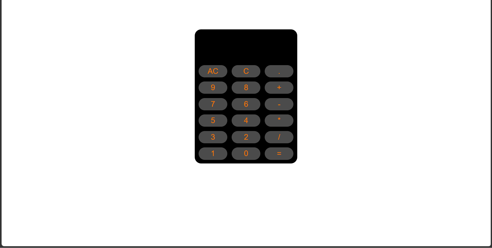
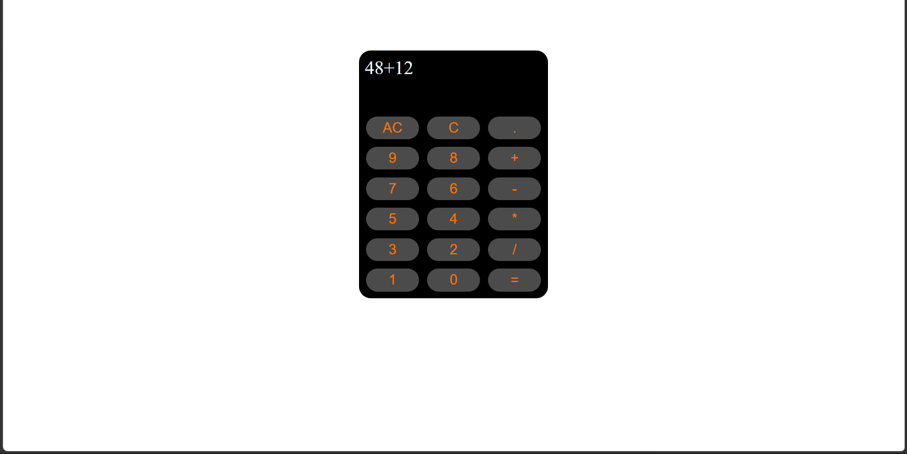
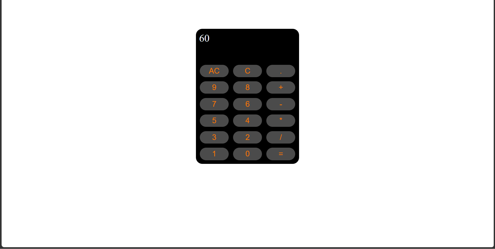

# 🧮 Web Calculator

A simple and interactive **Calculator Web Application** built using **HTML, CSS, and JavaScript**.

The calculator provides a clean interface for performing basic mathematical calculations directly in the browser.

## ✨ Features

* ➕ Addition
* ➖ Subtraction
* ✖️ Multiplication
* ➗ Division
* 🔢 Decimal number support
* 🧹 Clear the complete calculation
* ⬅️ Remove the last entered character
* 🟰 Calculate the result
* ⚠️ Displays an error message for invalid expressions
* 🖥️ Simple and clean calculator interface

## 📸 Screenshots

### Calculator Interface

## 🛠️ Technologies Used

* **HTML**
* **CSS**
* **JavaScript**

## ⚙️ How It Works

The calculator interface is created using HTML buttons for numbers and mathematical operators. The buttons call JavaScript functions when clicked.

JavaScript stores the entered calculation in an `expression` variable. Each button press adds its value to the expression and updates the calculator display.

### Calculator Controls

* **AC** — Clears the complete expression.
* **C** — Removes the last character.
* **`.`** — Adds a decimal point.
* **`+`** — Addition.
* **`-`** — Subtraction.
* **`*`** — Multiplication.
* **`/`** — Division.
* **`=`** — Calculates the entered expression.

## 🎨 Design

The calculator uses CSS to create a centered layout with a dark calculator body, rounded corners, grid-based buttons, and hover effects.

## 🎯 Learning Concepts

This project demonstrates:

* HTML structure
* CSS styling
* CSS Grid
* JavaScript DOM manipulation
* JavaScript functions
* Event handling with `onclick`
* String manipulation
* Expression evaluation
* Basic error handling

## 👨‍💻 Author

**Abhinav**

A beginner-friendly web development project created for practicing **HTML, CSS, JavaScript, and basic DOM manipulation**.
