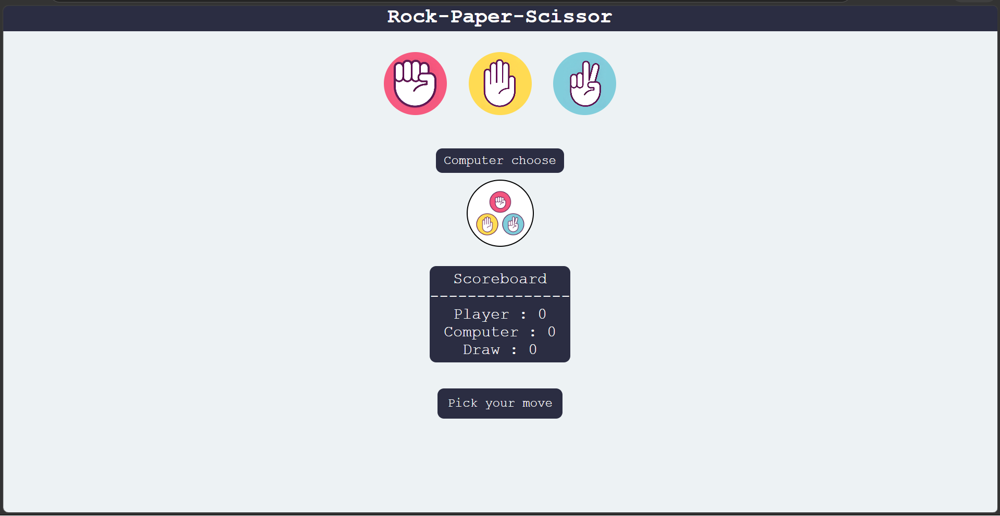
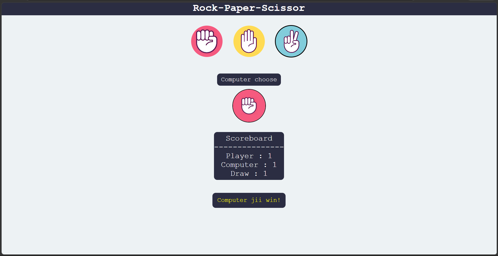

# ✊📄✂️ Rock-Paper-Scissor Game

A simple and interactive **Rock-Paper-Scissor Game** built using **HTML, CSS, and JavaScript**.

The player can choose Rock, Paper, or Scissor, while the computer randomly selects its move. The game compares both choices, determines the winner, and keeps track of the scores.

## ✨ Features

* ✊ Rock
* 📄 Paper
* ✂️ Scissor
* 🤖 Computer makes a random choice
* 🏆 Determines the winner of each round
* 🤝 Tracks draw games
* 📊 Live scoreboard
* 💬 Displays the result of each round
* 🖼️ Displays the computer's selected move
* 🖱️ Interactive buttons for player choices

## 📸 Screenshots

### Game Interface




## 🛠️ Technologies Used

* **HTML**
* **CSS**
* **JavaScript**

## ⚙️ How It Works

The game provides three buttons for the player to select **Rock, Paper, or Scissor**.

When the player selects a move, JavaScript randomly generates the computer's choice from the three available options.

The game then compares the two choices:

* ✊ **Rock beats Scissor**
* 📄 **Paper beats Rock**
* ✂️ **Scissor beats Paper**
* 🤝 Same choices result in a draw

The player's score, computer's score, and number of draws are updated after every round.

The computer's selected move is also displayed on the screen using the corresponding image.

## 📊 Scoreboard

The game maintains three scores:

```text
Player : 0
Computer : 0
Draw : 0
```

These values are updated dynamically whenever a round is completed.

## 🎨 Design

The interface uses CSS Flexbox to arrange the game elements and create a centered layout. The Rock, Paper, and Scissor buttons are circular and use images as their backgrounds.
The game also includes hover effects on the buttons for a more interactive experience.

## 🎯 Learning Concepts

This project demonstrates:

* HTML structure
* CSS styling
* CSS Flexbox
* JavaScript DOM manipulation
* JavaScript event listeners
* Functions
* Random selection
* Conditional statements
* Score tracking
* Dynamic HTML content
* Basic game logic

## 👨‍💻 Author

**Abhinav**

A beginner-friendly web development project created for practicing **HTML, CSS, JavaScript, DOM manipulation, and interactive game development**.
