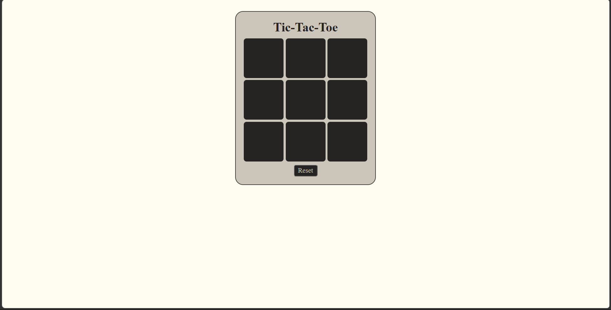
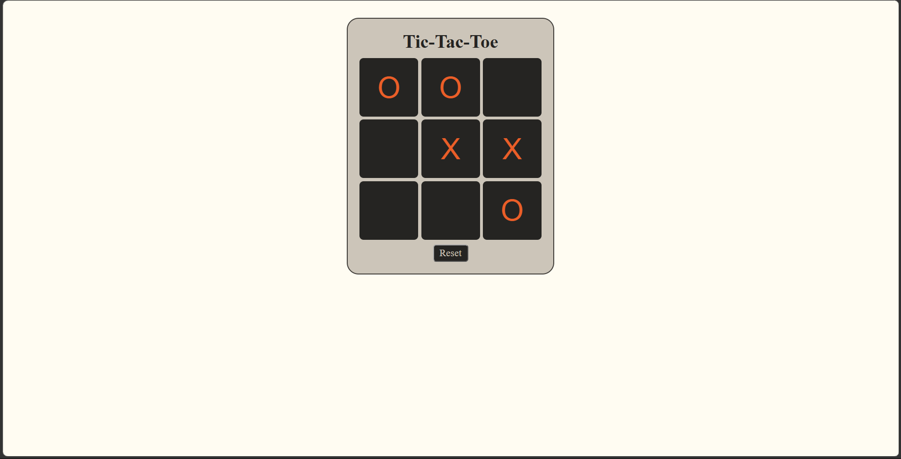

# ❌⭕ Tic-Tac-Toe Game

A simple and interactive **Tic-Tac-Toe game** built using **HTML, CSS, and JavaScript**.

The game provides a 3×3 board where two players take turns placing **O** and **X**. The game automatically checks for a winning combination and displays the winner or a draw message.

## ✨ Features

* ❌ X and ⭕ O gameplay
* 👥 Two-player game
* 🎮 Interactive 3×3 game board
* 🏆 Automatic winner detection
* 🤝 Draw detection
* 🔒 Disables selected boxes after a move
* 🔄 Reset the current game
* 🆕 Start a new game after winning or drawing
* 💬 Displays the game result

## 📸 Screenshots

### Game Interface




## 🛠️ Technologies Used

* **HTML**
* **CSS**
* **JavaScript**

## ⚙️ How It Works

The game uses a **3×3 grid containing nine buttons**. Players click an empty box to make their move.

The game starts with **O's turn**. After each click, the turn switches between O and X, and the selected box is disabled to prevent it from being selected again.

### 🏆 Winner Detection

The game checks the board against **eight possible winning patterns**:

* Three horizontal rows
* Three vertical columns
* Two diagonals

If three matching symbols are found in one of these patterns, the game displays the winner and disables the remaining boxes.

### 🤝 Draw Detection

If all nine boxes are filled without a winner, the game displays:

```text
It's a draw
```

### 🔄 Reset & New Game

The **Reset** button clears the board and starts the game again.

The **New Game** button also clears the board, resets the turn and move count, and allows players to start a new match.

## 🎨 Design

The game uses CSS Grid to create the 3×3 board. The interface includes a centered layout, styled game boxes, a reset button, and a result message area.

The game boxes are styled with large text and rounded corners to make the board simple and easy to interact with.

## 🎯 Learning Concepts

This project demonstrates:

* HTML structure
* CSS styling
* CSS Grid
* JavaScript DOM manipulation
* Event listeners
* Functions
* Arrays
* Loops
* Conditional statements
* Game-state management
* Winner detection logic
* Event handling

## 👨‍💻 Author

**Abhinav**

A beginner-friendly web development project created for practicing **HTML, CSS, JavaScript, DOM manipulation, and game development logic**.
